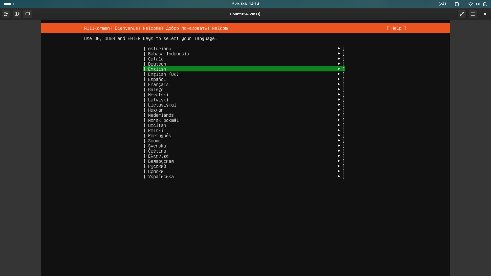
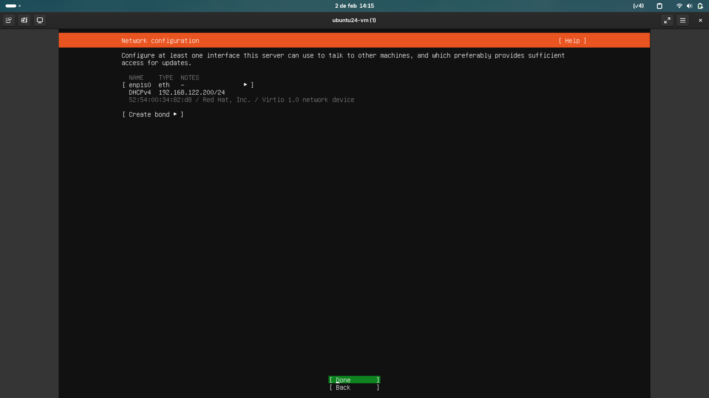
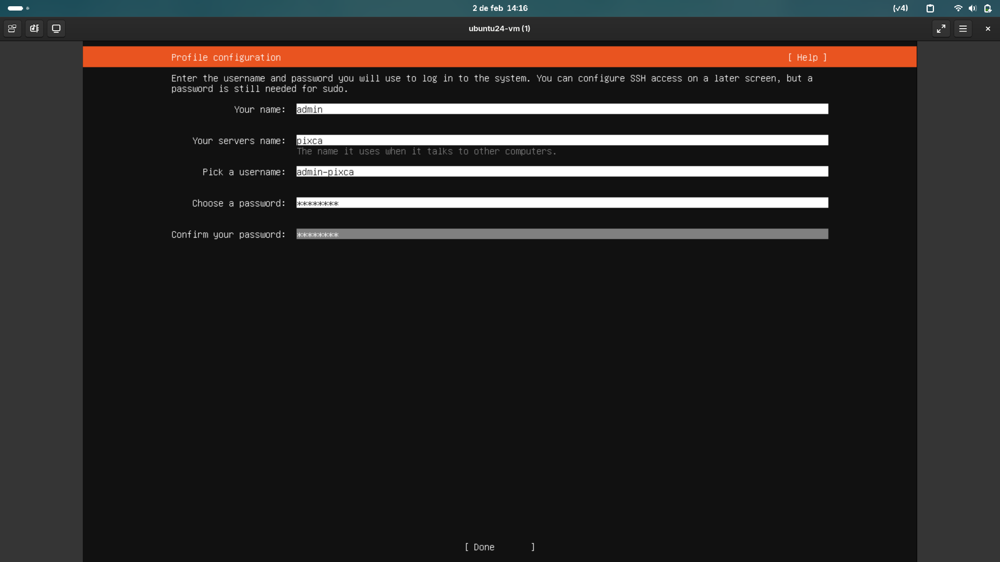
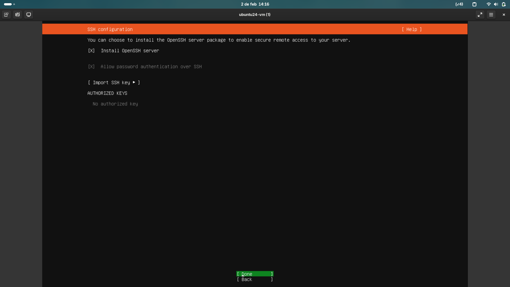

# 🐧 Instalar Ubuntu Server

## 🖼️ Instalar imagen

Puedes obtener la imagen (**.iso**) de Ubuntu Server en la siguiente página. [Ubuntu Server](https://ubuntu.com/download/server)

## ⚡Bootear USB

Para bootear el USB podemos usar el siguiente comando. 

```bash
sudo dd if=imagen.iso of=/dev/sdX bs=4M status=progress
```

> Nota: imagen.iso es la ubicación de la imagen y `/dev/sdX` es la ubicación de tu USB. Puedes consultarla con el comando `lsblk`

O usar una aplicación con Balena Etcher.

## Inicializar servidor

Para poder instalar Ubuntu Server colocamos la USB en algún puerto USB del servidor. Esperamos a que cargue el BIOS y apretamos `F12` y seleccionamos nuestro dispositivo USB.

## 💾 Configurar Instalación

Al iniciar la instalación verás una pantalla como está.



Cuando llegues al paso de configuración de red es importante ya tener cableada la conexión **Ethernet**. 
Además si la dirección IP de los puertos de red está cerrada es importante cargarla.



Configuramos nuestras credenciales.



Habilitamos SSH.



Y finalizamos la instalación.


[Anterior](../README.md) | [Siguiente](02-Nginx.md)