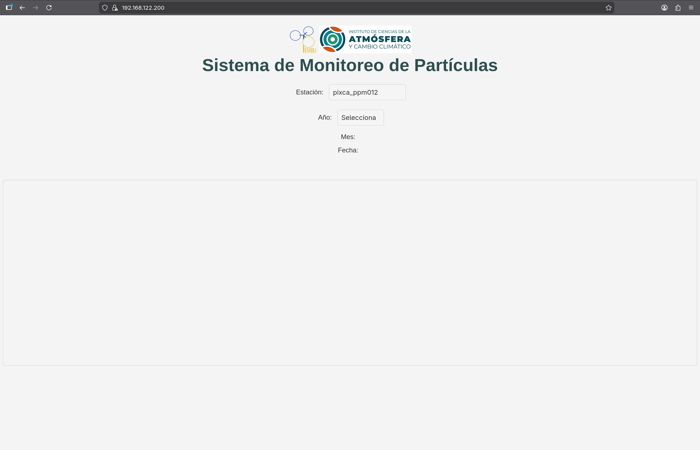

# 🛜 Desplegando la aplicación web

## ⬇️ Instalación

Usaremos el siguiente repositorio para cargar la página web. [Aplicación Web](https://github.com/ma-robles/pixca-ppm)

Deberemos clonarlo en la siguiente ruta:

```bash
cd /var/www/html
sudo git clone https://github.com/ma-robles/pixca-ppm
```

## Iniciar Servicio

Verificamos que nuestro archivo de **NGINX** tenga una correcta sintáxis.

```bash
sudo nginx -t
```

> Nota: Si falla regresa a [NGINX](02-Nginx.md)

Y reiniciamos el servicio.

```bash
sudo systemctl restart nginx
```

## Configurar Rutas

Antes de poder usar nuestra API en conjunto con nuestra página web deberemos realizar algunas modificaciones a los repositorios.

Edita el archivo:

```bash
nano ~/pixca-ppm_api/pixca-ppm_api.js
```

Y asegúrate de que las constantes coincidan con nuestra configuración local:

- Host e IP: Cambia el dominio por la IP local del servidor.

- Path de datos: Ajusta la ruta a la carpeta data/ local. 

- Certificados: Apunta a la ruta absoluta donde guardamos los certificados de OpenSSL (/etc/nginx/ssl/).

```javascript
// Antes
const host = 'ruoa.unam.mx';
const path_data = "pm-pembu/data/";

// Ahora
const host = 'IP' // Aquí va tu IP;
const path_data = "data/";

// Configuración de certificados SSL
var options = {
    key: fs.readFileSync('/etc/nginx/ssl/private.key'),
    cert: fs.readFileSync('/etc/nginx/ssl/certificate.crt')
};
```

> Nota: Puedes ver tu ip con `ip a`.

Para que podamos comprobar que la API funciona deberemos crear:

```bash
mkdir -p ~/data/pixca_ppm012
```

De igual manera deberemos modificar la URL que usa el `script.js`

Edita el archivo:

```bash
nano /var/www/html/pixca-ppm/script.js
```

Cambiamos esta linea:

```javascript
// Antes
const url = 'https://10.20.12.50:8042/pm_api&sid='+ sid + '&date='+ date;

// Después
const url = 'https://IP:8041/pm_api&sid='+ sid + '&date='+ date; // Aquí va tu API

```

Y finalmente también deberemos modificar la IP que usa el `plot.js`

Edita el archivo:

```bash
nano /var/www/html/pixca-ppm/lib/plot.js
```

Cambiamos esta linea:

```javascript
// Antes
const ip = 'https://10.20.12.50:8042'

// Después
const ip = 'https://IP:8041' // Aquí va tu nueva IP

```

## ➜🚪 Ingresar

Deberas colocar por la IP de tu servidor en un navegador web. Como nos autocertificamos saltará una alerta. Deberas avanzar de todos modos. 

Veras algo como lo siguiente


Podras comprobar que la API funciona seleccionando la `pixca_ppm012`
Si carga la selección de año entonces lo está haciendo correctamente. ✅

